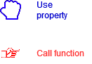

# BodybuildingPrograms

An app for set Fitness and body building programs 

## Contents
**I** *- Versions*

**II** *- About it*
* **A** *- Why this ?*
* **B** *- What is it ?*
* **C** *- Platform target*

**III** *- Tools*
* **A** *- Research*
* **B** *- Software*
* **C** *- Language*

**IV** *- Project*
* **A** *- Model*
	* *Legend*
	* *Diagram*
* **B** *- Project structur*
	* *Legend*
	* *Main*
		* *res/layout*
		* *java/fr/matthiasdetoffoli/bodybuildingprograms*
			* *Activities*
			* *Buttons*
			* *EditText*
				* *Number*
* **C** *- Packages*
* **D** *- Coding rules*
	* *Import*
	* *Packages*
	* *Structurs of a class*
	* *Singletons*
	* *Brackets*
	* *Regions*
	* *Methods*
	* *Comments*
	* *Variables*
	* *Strings*
	* *Values*
	* *Condition*
	* *Loops*
	* *Nomenclature*
		* *Folders*
		* *Packages*
		* *Classes*
		* *Metodes*
		* *Constants*
		* *Properties*
		* *Members*
		* *Variables*
		* *Parameters*
		* *Enums*
* **E** *- Commit rules*
	* *Commit keywords*
	* *master*

**V** *- Hard points of the project*
* **A** *-Java*
* **B** *-Android studio*
* **C** *-How to resolved this problems ?*
	* *Java*
	* *Android studio*
## Versions
| VX.X | Date       | Title  						| Comments													| Author              |
| ---- | ---------- | ------------------------------| ----------------------------------------------------------| ------------------- |
| V0.0 | 05/13/2022 | Creation of the documentation	| Create the document and add the about it and tools part	| Matthias de Toffoli |
| V0.1 | 05/14/2022 | Add new parts on the document	| Add "project" and "hard points of the project" parts		| Matthias de Toffoli |


## About it
### Why this ?
For learning Java and Android studio.
### What is it ?
It's an Android Application where you can create and update Bodybuilding and Fitness programs
### Platform target
Android with SDK 32

## Tools
### Research
No tool researches was made for this project because the goal is to improve my skills with Android studio
### Software
Android studio Bumblebee | 2021.1.1 Patch 1
### Language
Java with Android API 32

## Project

### Model

All the user interfaces will interact with a singleton named Data, this class will manage all programs, the save and the loading in an xml file.

#### Legend

#### Diagram


### Project structur
Here we don't describe all elements created and updated by Android studio
#### Legend

#### Main

##### res/layout

##### java/fr/matthiasdetoffoli/bodybuildingprograms

###### Activities

###### Buttons

###### EditText


* *Number*


### Packages


### Coding rules
The main language of the project is english so all things has to be write in english (comments, names, classes, etc...)
#### Import
All imports are at top of the document and sort by alphabetical order.
*It's more legible.*

#### Packages
One package by documents, the package start with fr.matthiasdetoffoli.bodybuildingprograms and use folders name.
*With this type of package it will be easyer to find files.*

#### Structurs of a class
In the class write first the constants followed by the events, the members,  the properties, after that the constructors the methods and finally the classes. 
```java
MyClass 
{
	//region [Constants]
	//region [Events]
	//region [Members]
	//region [Properties]
	//region [Constructors]
	//region [Methods]
	//region [Objects]
}
```
*more legible*

### Singletons
use it less as possible.
*use too much singletons is not a good practice*

#### Brackets
Open the Bracket at the bottom of the instruction and start a new line for close it.

```java
Instruction() 
{
	…
}
```
If it's empty between the two brackets let them side by side
```java
Instruction() { }
```
*More legible*

#### Regions
Only in a class, 7 principal regions :
* Constants : used for all the constant
* Events : used for all the event
* Members : used for all private and protected members
* Properties : used for all public properties (also if it have a private set)
* Constructors : used for all the constructors
* Methods : used for all methods.
* Objects : used for all classes created in the current class
if you have nothing to put in the region don't write it, it's used only if you need it for exemple, if you have methods, use the region Methods but if you don't have properties, don't use the region Properties.
If you have many of methods link to a feature, you can add a subregion but only if it make your class more legible.
*More easier for find something in a class.*

#### Methods
Write in order of calling most as possible.
*Easier to read and understand*

#### Comments
Comment most as possible,
for classes, methods and properties use the summary
```java
/**
* ...
* @param pParam ...
* @return ...
```
complet all parts even if it's obvious (maybe it's not for others)
For comments in metodes use simple comments with //
don't write comments at the left of a line all comments has to be in it own line, let a blank line
before write a comment but not after.
```java
code

//comments
code
```
*More legible*

#### Variables
All variables has to be create at the start of the function even for loop's variables don't let blank line
between two variable declaration (except if you have a comments before one of them) but let one
after all variables declarations.
You can declar some variables in the same line if no one is initialized in the declarations, always go to the
next line after an initizialition.
```java
private void MyFunction () 
{
	int i,j = 0 ;
    int k ;
    String str ;
    //comments
    float l ;
    Object obj ;
    l = 0.5f;
}
```

*More legible*

#### Strings
Use strings metodes more than possible (String.format is better than str + str2)
*More performant*

#### Values
Never write a value directly
```java 
if(lifeAnswer == 42)
```
always write values in constant or variable
```java 
TRUE_ANSWER = 42; 
if (lifeAnswer == TRUE_ANSWER)
```
*More legible and efficient if you have to change the value*

#### Condition
You can don't use brackets with a if, only if it's a value to set in the same line or before a loop like :

```java
if(lMyInt == 17) 
	lMyIntIsSeventeen = true;
	
if(lCanUseLoop)
	for(i = 0, l = 3; i < l; i++) 
	{
		...
	}
```
Use the brackets for conditions before a return too.
Go to the next line before write else
It's possible to use ? But just one per line and for short conditions. (don't do var = test ? A : test2 ? B : C) use space around ? And around :
*More legible*

#### Loops
Use most as possible for loops, always use brackets with it
```java
int i,l ;
for (i = 0, l = 3 ; i < l ; i++) 
{
	...
}
```
it's more easier for make a reverse for loop
```java
int i,l ;
for (i = 0, l = 3 ; i < l ; l--) 
{
	...
}
```
*More legible*

#### NOMENCLATURE
##### Folders
Upper camel case
*More legible.*
##### Packages
Like folders except fr.matthiasdetoffoli.bodybuildingprograms
*More legible*
##### Classes
Upper camel case
*More legible.*
##### Metodes
Lower camel case
*More legible.*
##### Constants
Write with capitale and every words separate with an underscore
*More legible.*
##### Properties
Lower camelcase
*More legible.*
##### Members
mMyField
*More legible*
##### Variables
lMyVar;
*More legible*
##### Parameters
pMyParameter
*More legible*
##### Enums
Write the name of the Enum  with upper camel case, all values will be wrote with majuscules and if it contain many words every words are seperate by an underscore.
```java
enum MyEnum 
{
	VAL_1,
	VAL_2,
	VAL_3
}
```
*More legible*

### Commit rules

#### Commit keywords
For this project I will use a key word between *[]* followed by a short description 

* [ADD] for all commit conserning the adding of a new feature. *I will not use it inevitably when I add a new element in my project *
* [UPDATE]  for all commit conserning the updating of an existing feature
* [FIX] for all commit conserning the fix of a feature
* [QUALITY] for all commit conserning quality (add a missing files, delete a useless file etc...)

I can add *.WIP* after the key for say it's not finished. If I do that the commit used when the featur will be finished will be the same without a WIP. That's mean a commit with the key *[ADD.WIP]* will be followed by a commit *[ADD]* when the feature will be finished.

#### master
I will push on master only finished features. The project have to always work on master. I will use other branches for my devellopments.

## Hard points of the project
### Java
Have to learn Java and it's API.
### Android studio
Have to learn how to use android studio and get used to the software
### How to resolved this problems ?
#### Java
it's pretty close to C#, forums and docs will help
#### Android studio
Internet and docs will help